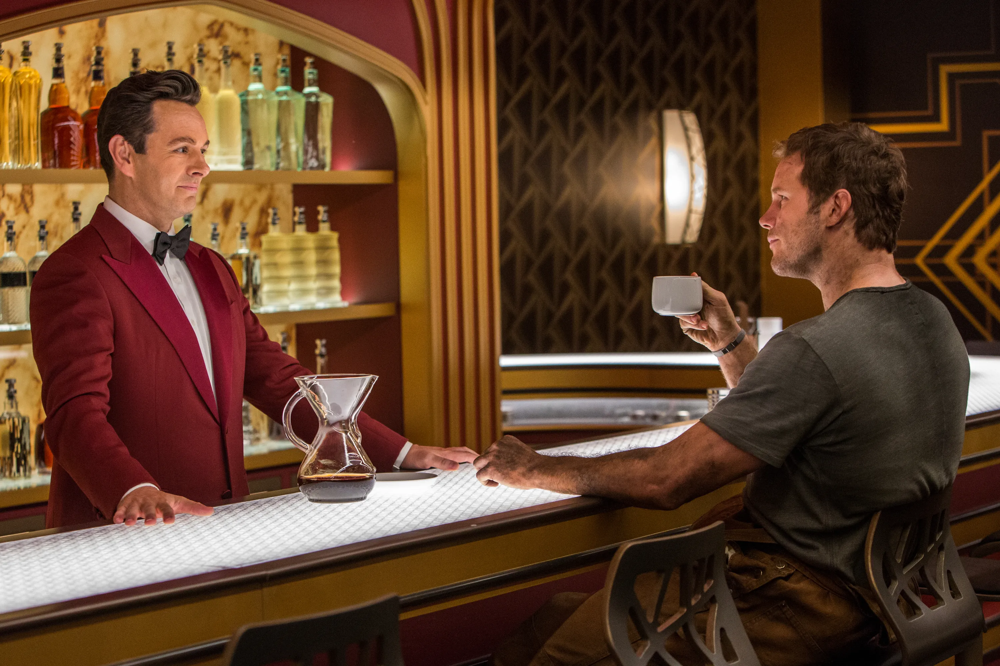

# Spacebar

## Authors
* Maksym Malicki, Jacek Glapiński - backend, API, prompt engineering
* Bartosz Wanot - fronted, godot and API integration

## Intro
Spacebar is a game where you play as a secret agent on a covert space station. During your mission, you interact with scientists—each one holds a piece of a secret password. When combined, these fragments initiate the station's self-destruction sequence.

Your goal as a secret agent is to trick the scientists into revealing their parts of the password!

You're undercover as a bartender on the station. Scientists visit your bar after long workdays—this is your chance to shine. Serve them drinks, earn their trust, and carefully steer the conversation. Hurry up, agent—every day on the station counts!

## Inner mechanisms
The game is powered by OpenAI's completion API. Each scientist is dynamically generated using a custom prompt. They have unique backstories that influence their drink preferences, which are also generated through prompting.

Your guests hint at the drink they want, but it's up to you to deduce the right ingredients. The closer you get, the more chances you earn to guess their password.

Conversations with scientists are also driven by an LLM. The passwords are protected by carefully crafted prompts—it won’t be easy to steal them. You’ll need creativity and social/prompt engineering skills to coax the passwords out of them through dialogue.

The game is inspired by https://tensortrust.ai/.

## Tech stack
Spacebar is developed using Godot and Python, with FastAPI and Uvicorn for the backend.
Frontend Godot implementation is derrived from this Repo (author: Bartosz Wanot), and just copied - so that the entire project is a monorepo: https://github.com/JustRiddle/spacebar?fbclid=IwY2xjawK4MXdleHRuA2FlbQIxMABicmlkETFYT0ZNMnY5REZhWm0yYnlYAR41Au-0BlipestNnhFBGBXKDJF7DmE5DSUjmXq5D5wQs73ePLpIQ9RxXspyXA_aem_2KxPWA8DNDmqfvfif9Iq7A.

